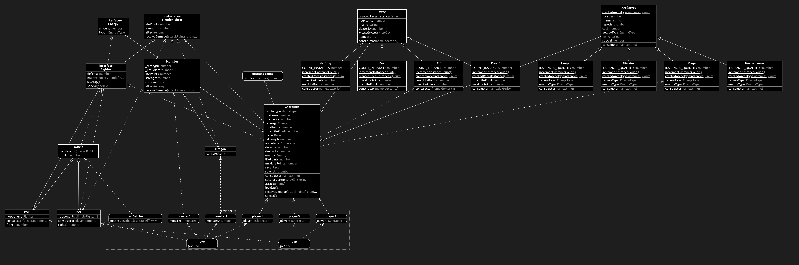

<div align="center">
  
</div>

---

## :memo: Descrição do Projeto

Este projeto é uma simulação de um jogo de interpretação de papéis, mais conhecidos como jogos `RPG` (_Role Playing Game_). Nele foram aplicados os princípios da arquitetura `SOLID` e os princípios de `POO` em TypeScript.

## 📋 Tabela de conteúdos

## 🎯 Objetivo do projeto

Aplicar os conhecimentos adquiridos sobre `SOLID` e `POO` em TypeScript, para criar um jogo de interpretação de papéis.

## 📝 O que pratiquei

Neste projeto, foi possível testar as habilidades:

- [x] Criar uma aplicação utilizando `SOLID` e `POO` em TypeScript
- [x] Implementar, em `TypeScript`, **Classes**, **Instâncias**, **Atributos** e **Métodos**
- [x] Usar os pilar da `POO` para criar uma aplicação
  - [x] Abstração
  - [x] Encapsulamento
  - [x] Herança
  - [x] Polimorfismo
  - [x] Composição
- [x] Escrever funções e classes que tenham uma única responsabilidade no escopo da sua aplicação.
- [x] Escrever classes com funções que estão abertas para extensão e fechadas para modificação.
- [x] Substituir objetos por instâncias de seus subtipos, sem alterar a funcionalidade do programa.
- [x] Compreender que muitas interfaces específicas são melhores do que uma para todos os propósitos.
- [x] Compreender que a composição é uma alternativa mais flexível à herança.

## 🛠 Tecnologias utilizadas

As seguintes ferramentas foram usadas na construção do projeto:

- [Typescript](https://expressjs.com/pt-br/)
- [Node.js](https://nodejs.org/en/)

## 🚀 Rodando o projeto na sua máquina

Para rodar o projeto na sua máquina é necessário alguns pre requisitos:

### 📍Pre Requisitos

#### Sem Docker

Antes de começar, você vai precisar ter instalado em sua máquina as seguintes ferramentas:
[Git](https://git-scm.com), [Node.js](https://nodejs.org/en/).

Além disto é bom ter um editor para trabalhar com o código como [VSCode](https://code.visualstudio.com/)!

Comandos para clonar o projeto na sua máquina:

```bash
# Clone este repositório com o comando:
git clone git@github.com:raphaelprsilva/trybers-and-dragons.git

# Acesse a pasta do projeto no terminal/cmd com o comando:
cd trybers-and-dragons

# Instale as dependências com o comando:
npm install
```

⚠ Atenção ⚠ Não rode o comando npm audit fix! Ele atualiza várias dependências do projeto, e essa atualização gera conflitos com o avaliador.

O projeto possui um arquivo `docker-compose.yaml`, ou seja, você pode rodar o projeto com o Docker. Então caso você opte por:

#### Rodando Com Docker

> Rode o serviço `node` com o comando `docker-compose up -d`.

- Esse serviço irá inicializar um container chamado `trybers_and_dragons`.
- A partir daqui você pode rodar o container `trybers_and_dragons` via CLI ou abri-lo no VS Code.

> Use o comando `docker exec -it trybers_and_dragons bash`.

- Ele te dará acesso ao terminal interativo do container criado pelo compose, que está rodando em segundo plano.

> Instale as dependências [**Caso existam**] com `npm install`

⚠ Atenção ⚠ Caso opte por utilizar o Docker, **TODOS** os comandos disponíveis no `package.json` (npm start, npm test, npm run dev, ...) devem ser executados **DENTRO** do container, ou seja, no terminal que aparece após a execução do comando `docker exec` citado acima.

⚠ Atenção ⚠ O **git** dentro do container não vem configurado com suas credenciais. Ou faça os commits fora do container, ou configure as suas credenciais do git dentro do container.

⚠ Atenção ⚠ Não rode o comando npm audit fix! Ele atualiza várias dependências do projeto, e essa atualização gera conflitos com o avaliador.

✨ **Dica:** A extensão `Remote - Containers` (que estará na seção de extensões recomendadas do VS Code) é indicada para que você possa desenvolver sua aplicação no container Docker direto no VS Code, como você faz com seus arquivos locais.


## Contextualização do projeto

Quase todos os seres vivos que vagam por essas áreas no universo Trybers and Dragons são membros de uma raça específica.

Desde o início do jogo, as várias raças (como, por exemplo, élfico, orc ou anão) definiram os atributos dos personagens, incluindo seus pontos de vida e destreza. Mas existem bestas conhecidas como monstros que podem lutar, mas não são membros de nenhuma raça em particular.

Algumas criaturas também possuem uma energia e, conforme praticam seu uso, desenvolvem um arquétipo. Em geral, os arquétipos descrevem a profissão, habilidades e visão de mundo de um personagem, incluindo como eles lidam com desafios, exploram masmorras e se envolvem com inimigos. Podemos usar o guerreiro, o mago e o necromante como exemplos de arquétipos vistos em T&D.

Simplesmente por possuírem certas qualidades, grande parte dos seres pode ser categorizada como guerreira. A luta pode acontecer frequentemente entre vários indivíduos, bem como entre personagens e monstros.

A estrutura do projeto é a seguinte:



- `src` - pasta onde ficam todos os arquivos relacionados ao código da aplicação;

  - `src/Archetypes` - pasta onde ficam todos os arquivos relacionados aos arquétipos;

    - `src/Archetypes/Archetype.js` - arquivo onde fica a classe base para os arquétipos;
    - `src/Archetypes/Warrior.js` - arquivo onde fica a classe para o arquétipo guerreiro;
    - `src/Archetypes/Mage.js` - arquivo onde fica a classe para o arquétipo mago;
    - `src/Archetypes/Necromancer.js` - arquivo onde fica a classe para o arquétipo necromante;

  - `src/Battle` - pasta onde ficam todos os arquivos relacionados às batalhas;

    - `src/Battle/Battle.ts` - arquivo onde fica a classe base para as batalhas;
    - `src/Battle/PVE.ts` - arquivo onde fica a classe para as batalhas entre personagens e máquina;
    - `src/Battle/PVP.ts` - arquivo onde fica a classe para as batalhas entre personagens;

  - `src/Fighter` - pasta onde ficam todos os arquivos relacionados aos lutadores;

    - `src/Fighter/Fighter.ts` - arquivo onde fica a interface base para os lutadores;
    - `src/Fighter/SimpleFighter.ts` - arquivo onde fica a interface para os personagens;

  - `src/Races` - pasta onde ficam os arquivos relacionados às raças;

    - `src/Races/Dwarf.ts` - arquivo onde fica a classe para os anões;
    - `src/Races/Elf.ts` - arquivo onde fica a classe para os elfos;
    - `src/Races/Halfling.ts` - arquivo onde fica a classe para os Halflings;
    - `src/Races/Orc.ts` - arquivo onde fica a classe para os Orcs;

  - `src/Character.ts` - arquivo onde fica a classe para os personagens;
  - `src/Dragon.ts` - arquivo onde fica a classe para os dragões;
  - `src/Energy.ts` - arquivo onde fica a classe para a energia;
  - `src/Monster.ts` - arquivo onde fica a classe para os monstros;

## 👉🏾 Status do projeto

O projeto se encontra finalizado!

## 🤝 Colaboradores

<table>
  <tr>
    <td align="center">
      <a href="http://github.com/raphaelprsilva">
        <br>
        <sub>
          <b>raphaelprsilva</b>
        </sub>
      </a>
    </td>
  </tr>
</table>
